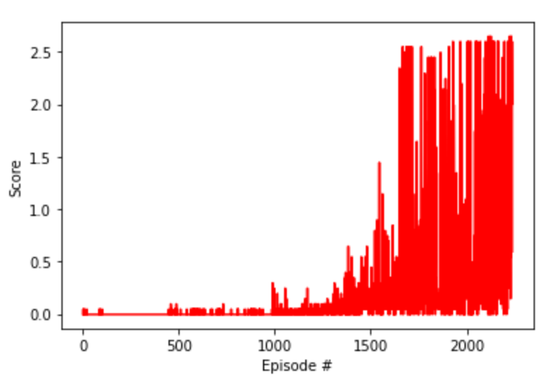

# Report

This work utilised the [MADDPG](https://arxiv.org/abs/1706.02275) (Multi-Agent Actor-Critic for Mixed Cooperative-Competitive Environments) architecture outlined in the original paper

## State and Action Spaces

In this environment, two agents control rackets to bounce a ball over a net. If an agent hits the ball over the net, it receives a reward of +0.1.  If an agent lets a ball hit the ground or hits the ball out of bounds, it receives a reward of -0.01.  Thus, the goal of each agent is to keep the ball in play.

The observation space consists of 8 variables corresponding to the position and velocity of the ball and racket. Each agent receives its own, local observation.  Two continuous actions are available, corresponding to movement toward (or away from) the net, and jumping. 

## Learning Algorithm

In MADDPG, each agent’s critic is trained using the observations and actions from all the agents, whereas each agent’s actor is trained using just its own observations. This allows the agents to be effectively trained without requiring other agents’ observations during inference (because the actor is only dependent on its own observations). Here is the gist of the MADDPG algorithm :


The task is episodic, and in order to solve the environment, our agents must get an average score of +0.5 (over 100 consecutive episodes, after taking the maximum or average over both agents). Specifically,

- After each episode, we add up the rewards that each agent received (without discounting), to get a score for each agent. This yields 2 (potentially different) scores. We then take the maximum (or average) of these 2 scores.
- This yields a single **score** for each episode.

The environment is considered solved, when the average (over 100 episodes) of those **scores** is at least +0.5.

For each time step (**during training only**), each Agent acts upon the state utilising **shared experiences** using same `replay_memory`

### Hyper Parameters

- n_episodes (int): maximum number of training episodes
- BUFFER_SIZE (int): replay buffer size
- BATCH_SIZ (int): mini batch size
- GAMMA (float): discount factor
- TAU (float): for soft update of target parameters
- LR_ACTOR (float): learning rate for optimizer
- LR_CRITIC (float): learning rate for optimizer
- WEIGHT_DECAY (float): L2 weight decay
- UPDATE_TIMES (int): number of learning updates
- UPDATE_EVERY (int): every n time step do update
- OU_SIGMA (float) : Ornstein-Uhlenbeck noise parameter
- OU_THETA (float) : Ornstein-Uhlenbeck noise parameter


Where 
`n_episodes=4000`, `BUFFER_SIZE = int(1e5)`, `BATCH_SIZE = 128`, `GAMMA = 0.99`, `TAU = 1e-3`, `LR_ACTOR = 1e-3`, `LR_CRITIC = 1e-3`, `WEIGHT_DECAY = 0.0`, `UPDATE_TIMES = 1`, `UPDATE_EVERY = 1`, `OU_SIGMA = 0.2` and `OU_THETA = 0.15`


### Neural Networks

Actor and Critic network models were defined in [`model.py`](https://github.com/rmoin/CollaborationCompetition/blob/master/model.py).

The Actor networks utilised two fully connected layers with 400 and 300 units with batch norm, relu activation and tanh activation for the action space. The network has an initial dimension the same as the state size+1 (size 25 state vector, where 24 env state and +1/-1 for each agent)

The Critic networks utilised two fully connected layers with 400 and 300 units with batch norm and relu activation. The critic network has  an initial dimension the size of the state size+1 plus action size.

## Plot of rewards


```
Episode 1500	 Mean Score for Agent 1: 0.126, Mean Score for Agent 2: 0.151, Mean Score of both Agents: 0.138
Episode 1600	 Mean Score for Agent 1: 0.189, Mean Score for Agent 2: 0.186, Mean Score of both Agents: 0.187
Episode 1700	 Mean Score for Agent 1: 0.484, Mean Score for Agent 2: 0.479, Mean Score of both Agents: 0.482
Episode 1800	 Mean Score for Agent 1: 0.538, Mean Score for Agent 2: 0.545, Mean Score of both Agents: 0.542
Episode 1900	 Mean Score for Agent 1: 0.549, Mean Score for Agent 2: 0.546, Mean Score of both Agents: 0.548
Episode 2000	 Mean Score for Agent 1: 0.582, Mean Score for Agent 2: 0.579, Mean Score of both Agents: 0.580
Episode 2100	 Mean Score for Agent 1: 0.695, Mean Score for Agent 2: 0.688, Mean Score of both Agents: 0.691
Episode 2200	 Mean Score for Agent 1: 0.835, Mean Score for Agent 2: 0.837, Mean Score of both Agents: 0.836

```
Environment get SOLVED somewhere between (1700-1800) episodes, when mean score = +0.5 over last 100 episodes. 
We trained till the mean score = 1, somewhere between (2200-2300) episodes


## Ideas for Future Work

Training occured on mac - no GPU, 6-core Intel i9, 16 GB RAM. It took more than an hour to train till 2300 episodes. In earlier versions of implementations, we had trouble getting the agents to learn. To combat this, we changed the hyperparameter value `UPDATE_TIMES = 1`, `UPDATE_EVERY = 1` i.e to let the training happens at each time step.

In terms of things to try in the future, we can use Multi Agent Proximal Policy Optimization (MAPPO) to see how it compares to MADDPG. Also, we can explore prioritized experience replay — rather than selecting experience tuples randomly, prioritized replay selects experiences based on a priority value that is correlated with the magnitude of error. 